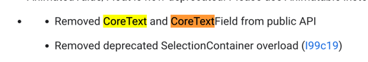

# 03장 컴포즈 핵심 원칙 자세히 알아보기

## 컴포저블 함수 자세히 살펴보기

### 컴포저블 함수의 구성 요소
- 가시성 변경자: 용도에 따라 접근 범위를 정하면 되겠다.
- fun
- 함수명: **파스칼 표기법**으로 작성
- 매개변수: 선택적
- 반환 타입: 선택적 -> 값을 리턴하지 않아도 Composable 함수가 화면에 표현된다.
- 코드 블록

### UI 요소 내보내기
- IDE를 이용해 직접 확인해보기

#### androidx.compose.material.Text()

```kotlin
val textColor = color.takeOrElse {
    style.color.takeOrElse {
        LocalContentColor.current
    }
}
// NOTE(text-perf-review): It might be worthwhile writing a bespoke merge implementation that
// will avoid reallocating if all of the options here are the defaults
val mergedStyle = style.merge(
    TextStyle(
        color = textColor,
        fontSize = fontSize,
        fontWeight = fontWeight,
        textAlign = textAlign,
        lineHeight = lineHeight,
        fontFamily = fontFamily,
        textDecoration = textDecoration,
        fontStyle = fontStyle,
        letterSpacing = letterSpacing
    )
)
BasicText(
    text,
    modifier,
    mergedStyle,
    onTextLayout,
    overflow,
    softWrap,
    maxLines,
)
```

#### BasicText()

> **BasicText**에서 찾은 CoreText 관련 주석
> 
> The ID used to identify this CoreText. If this CoreText is removed from the composition tree and then added back, this ID should stay the same.
> 
> Notice that we need to update selectable ID when the input text or selectionRegistrar has been updated.
> 
> When text is updated, the selection on this CoreText becomes invalid. It can be treated as a brand new CoreText.
> 
> When SelectionRegistrar is updated, CoreText have to request a new ID to avoid ID collision.


- https://developer.android.com/jetpack/androidx/releases/compose-foundation#1.0.0-alpha12
- CoreText는 public API에서 사용 불가
- BasicText() 하단부에서 Layout()을 호출하고 있다.

#### Layout()

```kotlin
@Suppress("NOTHING_TO_INLINE")
@Composable
@UiComposable
inline fun Layout(
    modifier: Modifier = Modifier,
    measurePolicy: MeasurePolicy
) {
    val density = LocalDensity.current
    val layoutDirection = LocalLayoutDirection.current
    val viewConfiguration = LocalViewConfiguration.current
    val materialized = currentComposer.materialize(modifier)
    ReusableComposeNode<ComposeUiNode, Applier<Any>>(
        factory = ComposeUiNode.Constructor,
        update = {
            set(measurePolicy, ComposeUiNode.SetMeasurePolicy)
            set(density, ComposeUiNode.SetDensity)
            set(layoutDirection, ComposeUiNode.SetLayoutDirection)
            set(viewConfiguration, ComposeUiNode.SetViewConfiguration)
            set(materialized, ComposeUiNode.SetModifier)
        },
    )
}
```

- ```ReusableComposeNode()```를 호출한다.
- Node라고 하는 UI 요소 계층 구조를 내보낸다.
- 노드는 factory를 통해 생성된다.
- ```update```: 업데이트를 수행하는 코드 작성
- ```skippableUpdate```: 변경자를 조작하는 코드 작성 -> ```materialized```로 바뀜

#### ReusableComposeNode()

```kotlin
/**
 * Emits a recyclable node into the composition of type [T].
 *
 * This function will throw a runtime exception if [E] is not a subtype of the applier of the
 * [currentComposer].
 *
 * @sample androidx.compose.runtime.samples.CustomTreeComposition
 *
 * @param factory A function which will create a new instance of [T]. This function is NOT
 * guaranteed to be called in place.
 * @param update A function to perform updates on the node. This will run every time emit is
 * executed. This function is called in place and will be inlined.
 *
 * @see Updater
 * @see Applier
 * @see Composition
 */
// ComposeNode is a special case of readonly composable and handles creating its own groups, so
// it is okay to use.
@Suppress("NONREADONLY_CALL_IN_READONLY_COMPOSABLE", "UnnecessaryLambdaCreation")
@Composable inline fun <T : Any, reified E : Applier<*>> ReusableComposeNode(
    noinline factory: () -> T,
    update: @DisallowComposableCalls Updater<T>.() -> Unit
) {
    if (currentComposer.applier !is E) invalidApplier()
    currentComposer.startReusableNode()
    if (currentComposer.inserting) {
        currentComposer.createNode { factory() }    // 여기서 노드를 생성한다.
    } else {
        currentComposer.useNode()   // 기존 노드 사용
    }
    currentComposer.disableReusing()
    Updater<T>(currentComposer).update()
    currentComposer.enableReusing()
    currentComposer.endNode()
}
```

- ```ReusableComposeNode```는 **새로운 노드가 생성돼야 할지 또는 기존 노드를 재사용해야 할지를 결정한다.**
- ```currentComposer```는 androidx.compose.runtime.Composables.kt에 있는 최상위 Composer 변수

#### ComposableUiNode

```kotlin
/**
 * Interface extracted from LayoutNode to not mark the whole LayoutNode class as @PublishedApi.
 */
@PublishedApi
internal interface ComposeUiNode {
    var measurePolicy: MeasurePolicy
    var layoutDirection: LayoutDirection
    var density: Density
    var modifier: Modifier
    var viewConfiguration: ViewConfiguration

    /**
     * Object of pre-allocated lambdas used to make use with ComposeNode allocation-less.
     */
    companion object {
        val Constructor: () -> ComposeUiNode = LayoutNode.Constructor
        val VirtualConstructor: () -> ComposeUiNode = { LayoutNode(isVirtual = true) }
        val SetModifier: ComposeUiNode.(Modifier) -> Unit = { this.modifier = it }
        val SetDensity: ComposeUiNode.(Density) -> Unit = { this.density = it }
        val SetMeasurePolicy: ComposeUiNode.(MeasurePolicy) -> Unit =
            { this.measurePolicy = it }
        val SetLayoutDirection: ComposeUiNode.(LayoutDirection) -> Unit =
            { this.layoutDirection = it }
        val SetViewConfiguration: ComposeUiNode.(ViewConfiguration) -> Unit =
            { this.viewConfiguration = it }
    }
}
```

- Modifier
- Density
- MeasurePolicy
- LayoutDirection
- VirtualConstructor (새로 생김)
- ViewConfiguration (새로 생김)

### 값 반환

- Composable 함수의 주목적은 UI 구성이기 때문에 대부분 반환 타입을 명시하지 않는다.
- Composition이나 Recomposition의 일부인 무언가를 반환해야 한다면 반드시 Composable 함수여야 한다.
- 반환된 데이터가 Compose와 아무 관련이 없더 상태를 유지하기 위한 값으로 사용한다면 Composable 함수로 만들어야 한다.
  - **이런 경우에는 함수명을 CamelCase로 작성**

## UI 구성과 재구성

## 컴포저블 함수의 행위 수정

## 요약